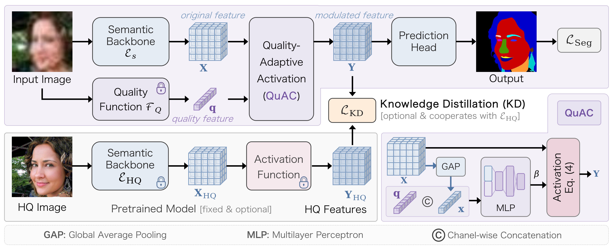
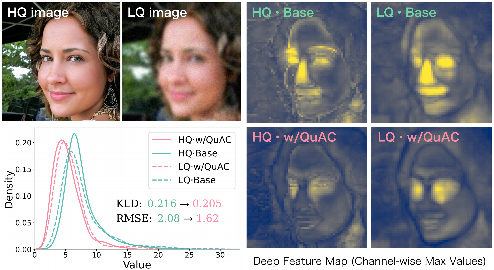
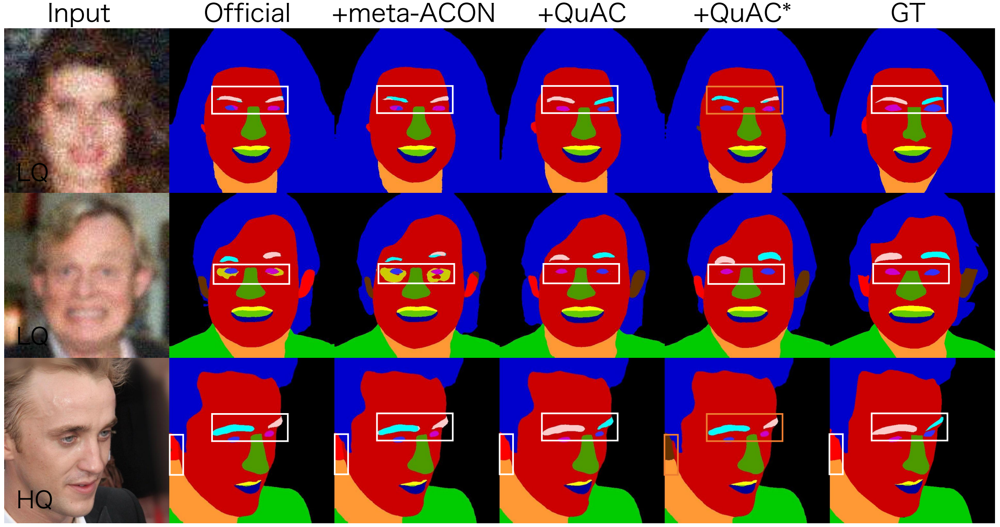

# QuAC: Quality-adaptive Activation
Quality-Adaptive Activation for Degraded Image Understanding

[](https://arxiv.org/abs/XXXX.XXXXX)
[](https://github.com/IIP-Lab-XDU/QuAC.git)

ß

**QuAC** is a novel **Q**uality-**a**daptive **A**ctivation that enables deep networks to dynamically adjust feature representations based on input image quality, significantly enhancing robustness against various degradations.

# Abstract
Degraded image understanding remains a significant challenge in computer vision. To mitigate the domain shift between high-quality and low-quality image distributions, we propose an adaptation approach based on activation functions rather than adjusting convolutional parameters. First, inspired by physiological findings in the human visual system, we introduce Quality-adaptive Activation (QuAC), a novel concept that automatically adjusts neuron activations based on input image quality to enhance essential semantic representations. Second, we implement Quality-adaptive meta-ACON (Q-ACON), which incorporates hyperparameters learned from image quality assessment functions. Q-ACON is efficient, flexible, and plug-and-play. Extensive experiments demonstrate that it consistently improves the performance of various networks—including convolutional neural networks, transformers, and diffusion models—against challenging degradations across multiple vision tasks, such as semantic segmentation, object detection, image classification, and image restoration. Furthermore, QuAC integrates effectively with existing techniques like knowledge distillation and image restoration, and can be extended to other activation functions. 

# Pipeline
<p align="center">
  
  <br>
  <!-- <em>图1: QuAC整体框架示意图</em> -->
</p>

<!-- ## 🔥 News
* **[2025.12.03]** QuAC code will to release!  -->
<!-- * **[2025.12.03]** Paper released at arxiv! -->
<!-- * **[2025.XX.XX]** Paper accetped at ! -->

## ✨ Key Features

- **🔌 Plug-and-Play**: Seamlessly integrated into existing CNNs as a replacement for or an addition to standard activation layers.
- **🎯 Quality-aware**: Employs IQA methods (e.g., BRISQUE, CONTRIQUE) to extract image quality features 
- **⚡ Effective & Efficient**: Significant performance gains with minimal computational overhead
- **🎯 Versatile**: Proven effective in segmentation, classification, detection, and image restoration


## 📈 Visual Results

### Activation Distribution Alignment
激活分布对比图

*QuAC reduces the activation distribution gap between HQ and LQ images (KLD: 0.216→0.205)*

### Qualitative Comparisons
*QuAC produces clearer structures and fewer artifacts in image restoration tasks*

<p align="center">
  
  <br>
  <!-- <em>图2: AST\SinST</em> -->
</p>


*QuAC generates segmentation results with clearer boundaries and more complete structures in complex scenes, significantly outperforming other methods.*
<p align="center">
  
  <br>
  <!-- <em>图4: RobustSAM</em> -->
</p>

*QuAC improves segmentation accuracy on degraded images under challenging scenarios.*
<p align="center">
  
  <br>
  <!-- <em>图5: SegNeXt</em> -->
</p>


## 🚀 Quick Start

### Installation
```bash
git clone https://github.com/IIP-Lab-XDU/QuAC.git
cd QuAC
pip install -r requirements.txt
```

## 📚 Citation

If you find our work useful in your research, please cite our paper

## 🙏 **Acknowledgements**  
We would like to express our gratitude to the following projects [**ACON**](https://github.com/nmaac/acon) and [**CONTRIQUE**](https://github.com/pavancm/CONTRIQUE)

## 📢 Contact
For questions or discussions, please open an issue or contact: wwhan@stu.xidian.edu.cn
